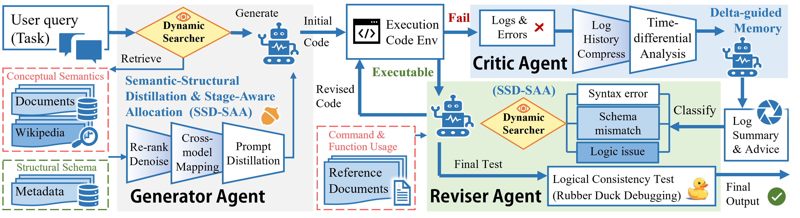

# LYNX: Collaborative Agents for Reliable NL-to-Analytics via Closed-Loop Verification

LLM-powered data analytics aims to enable domain experts to express complex analytical intent in nat-ural language and automatically translate it into executable analytical programs over underlying data. However, existing approaches—whether treating LLMs as intent-to-code translators or as standalone analytical engines—often fail to reliably align domain semantics with complex schemas and heterogeneous metadata, resulting in brittle execution and semantically inconsistent analytical outputs in real-world workloads. In this paper, we present LYNX, a multi-agent framework that formulates LLM-driven analytics as a schema- and knowledge-constrained analytical program synthesis problem rather than a single-pass generation task. LYNX organizes analytical synthesis into a closed-loop workflow of planning, generation, verification, and refinement through three role-specialized agents that collaboratively enforce schema grounding, semantic consistency, and execution correctness. To address domain ambiguity and schema misalignment, LYNX integrates Semantic-Structural Distillation and Stage-Aware Allocation (SSD-SAA). Furthermore, a delta-guided iterative revision continuously diagnoses and repairs semantic and execution-level failures, substantially improving synthesis robustness. We evaluate LYNX on two NL-to-SQL benchmarks, BIRD-SQL Mini-Dev and more challenging Spider 2.0-Lite. Experimental results demonstrate strong performance and efficiency, achieving 34%∼51% execution accuracy across models, while reducing token consumption by 70.53% compared with prior most efficient method. Also, our framework displays high generalization over different backbones, from open-source, lightweight models to latest commercial models. Additional case studies on quantitative finance analytics and complex multi-relational
SQL workloads further demonstrate the framework’s robustness, scalability, and practical applicability in real-world analytical scenarios

<p align="center">
    
</p>


## Project Structure

```
├── BIRD/
│   ├── BIRD-main/                # Clone the BIRD Mini_Dev
│   ├── dev_databases/			  # download database
│   └── ...
├── Spider2/				      # Clone the Spider2 repository
│   └── ...
├── stock_data/                   # 100-stock data for case study
│   └── 000516.SZ.csv
│   └── 000514.SZ.csv
│   └── ...
├── run_all.sh                    # overall control script for Spider2 tasks
├── bqtools.py                    # tool functions for BigQuery datasets
├── bqagent.py              	  # LYNX framework for BigQuery tasks
├── bigquery.py                   # task control script
├── sftools.py                    # tool functions for Snowflake datasets
├── sfagent.py              	  # LYNX framework for Snowflake tasks
├── run_snowflake.py              # Snowflake task control script
├── localtools.py                 # tool functions for SQlite3 datasets
├── localagent.py              	  # LYNX framework for SQlite3 tasks
├── local.py                      # SQlite3 task control script
├── birdtools.py                  # tool functions for BIRD Mini-Dev
├── birdagent.py              	  # LYNX framework adapted for BIRD
├── bird.py                  	  # implement script for BIRD benchmark
├── case_study.py                 # script for case study
├── config.json                   # API key
└── requirements.txt
```

## Setup

### 1. Install dependencies

```bash
pip install -r requirements.txt
```

### 2. Configure API keys

Edit `./config.json` and fill in:

- model name
- your username
- your API key                
- openAI API base (e.g. https://api.deepseek.com)

All model endpoints must be **OpenAI-compatible** (`/v1/chat/completions`).

### 3. Prepare benchmarks

**BIRD Mini_Dev: **follow the preparation process guidance in [BIRD Mini_Dev]([bird-bench/mini_dev](https://github.com/bird-bench/mini_dev/tree/main?tab=readme-ov-file)). Download the complete databases and datasets using the following link [Download BIRD Mini-Dev Complete Package](https://drive.google.com/file/d/13VLWIwpw5E3d5DUkMvzw7hvHE67a4XkG/view?usp=sharing) as  `./BIRD` directory. Then clone the repository of BIRD Mini_Dev into the path  `./BIRD/BIRD-main` . Please refer to the BIRD repository for the details of structure and necessary files.

**Spider2:** follow the preparation process guidance in [Spider2](https://github.com/xlang-ai/Spider2). Clone the whole repository into  `./Spider2` directory. ( Actually we only use the  `./Spider2/spider2-lite` part)


## Reproduction

### 1. BIRD Mini_Dev experiment

Run the task script.

```bash
python3 bird.py
```

**Evaluate the results:** Please post-process your collected results as the format: SQL and its `db_id`, which is splitted by `'\t----- bird -----\t'`. The examples are shown in the [`./llm/exp_result/turbo_output/predict_mini_dev_gpt-4-turbo_cot_SQLite.json`](https://github.com/bird-bench/mini_dev/blob/main/llm/exp_result/turbo_output/predict_mini_dev_gpt-4-turbo_cot_SQLite.json). Put the ground-truth sql file in the [`./data/`](https://github.com/bird-bench/mini_dev/blob/main/data). And you may need to design a ChatGPT tag by your own. The main file for ex evaluation is located at [`./llm/src/evaluation_ex.py`](https://github.com/bird-bench/mini_dev/blob/main/llm/src/evaluation_ex.py). Then you could evaluate the results by the following command line. ( Refer to the [bird-bench/mini_dev](https://github.com/bird-bench/mini_dev/tree/main?tab=readme-ov-file) Evaluation part carefully and remember to revise the path of predicted SQL and golden ones)

```bash
sh ./BIRD/BIRD-main/evaluation/run_evaluation.sh
```

The results folder will be the following structure in directory `./BIRD`:

```
├── output_<your model name>/
│   ├── task_progress.txt         # part of training resume module (don't edit it)
│   ├── task_log.csv			  # log of training (attempt times for every task)
│   ├── <task id>.sql        	  # generated SQLite3 query for task (e.g.120)
│   ├── <task id>.csv			  # retrieved data for specific task
│   ├── predict_result.json       # processed results aggregation as BIRD required
│   ├── evaluation_reults.txt     # overall evaluation results
│   └── ...
```


### 2. Spider2.0-lite experiment

Please remember first to sign up for BigQuery and Snowflake accounts (follow these two [guideline](https://github.com/xlang-ai/Spider2/blob/main/assets/Bigquery_Guideline.md), [guideline](https://github.com/xlang-ai/Spider2/blob/main/assets/Snowflake_Guideline.md) and fill out this [Spider2 Snowflake Access](https://docs.google.com/forms/d/e/1FAIpQLScbVIYcBkADVr-NcYm9fLMhlxR7zBAzg-jaew1VNRj6B8yD3Q/viewform?usp=sf_link)),  get your own credentials and put them in the right place. Details are shown in [Spider2-lite](https://github.com/xlang-ai/Spider2/tree/main/spider2-lite).

Run the task script.

```bash
sh run_all.sh
```

Evaluate the results: Use the [evaluation suite](https://github.com/xlang-ai/Spider2/tree/main/spider2-lite/evaluation_suite) provided by Spider 2.0-Lite. Organize the folder structure as it requires (Please carefully check the content in the above link) and run the commands.

```
python3 ./Spider2/spider2-lite/evaluation_suiteevaluate.py --result_dir <predicted_sqls_folder>
```

The results folder will be in the directory `./Spider2/spider2-lite` with the similar structure as those of BIRD Mini_Dev. You can check the `task_log.csv` for details.

```
├── output_<your model name>/
│   ├── task_progress.txt         # training resume module (don't edit it)
│   ├── task_log.csv			  # log of training (attempt times for every task)
│   ├── <task id>.txt        	  # generated SQL for task (e.g. bq169)
│   ├── <task id>.csv			  # retrieved data for specific task
│   └── ...
```

### 3. Case study of financial computing

Quantitative finance presents a challenging setting for LLMs due to limited grounding in domain-specific concepts (e.g. delta, ADV, and industry neutralization) and the scale of tabular time-series data spanning thousands of trading days. 

We apply LYNX to the computation of the **36th alpha factor** from the widely used[ **WorldQuant 101 Alphas**](https://arxiv.org/abs/1601.00991) ( you can also replace the expression with other factor in `case_study.py`). The inputs comprise CSV data for 100 stocks in `./stock_data`, each containing over 3,900 daily records and 33 financial attributes.

Run the task script.

```bash
python3 case_study.py
```

The results of generated python code and calculation csv will be in a new folder `./factors`.


## License

This project is released for academic research purposes with MIT license.
